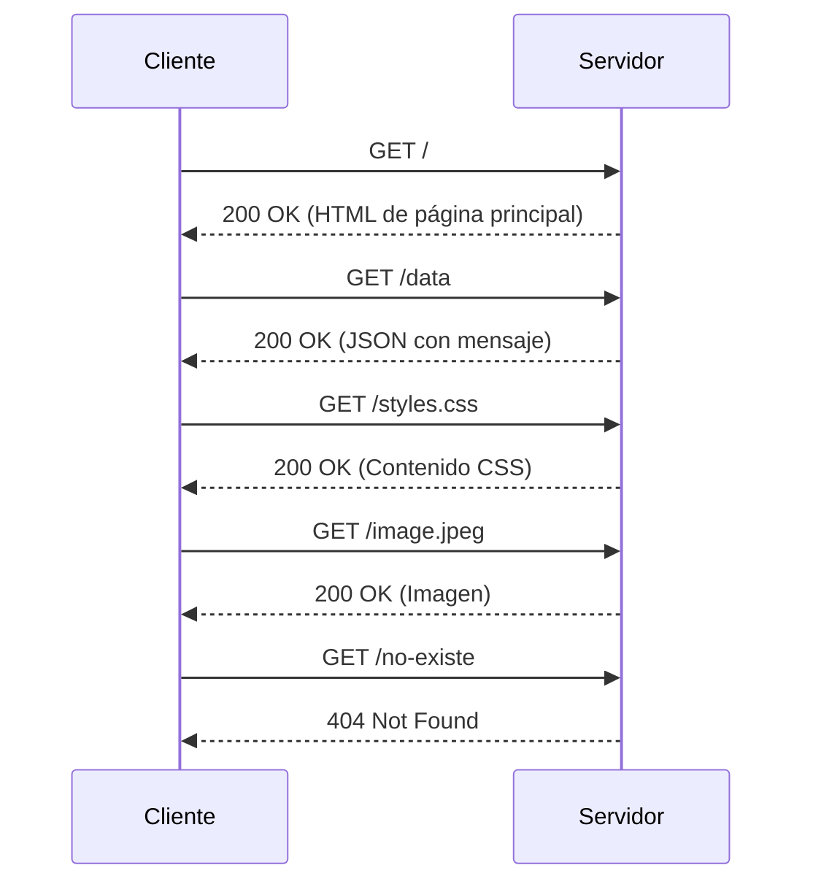
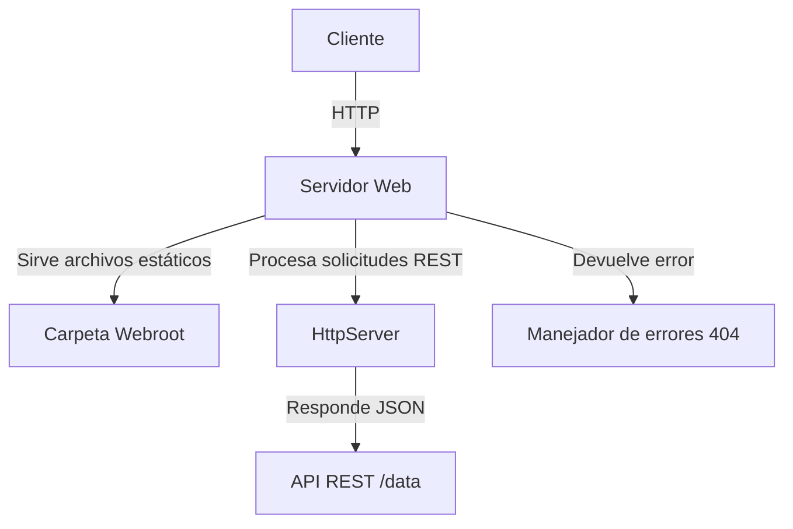

# WebServer Java Application
Tomas Suarez Piratova

Este proyecto implementa un servidor web en Java que maneja solicitudes HTTP para servir archivos estáticos (HTML, CSS, imágenes) y responder a solicitudes REST. Está diseñado para ser simple, eficiente y extensible.

## Requisitos

-   **Java Development Kit (JDK) 17 o superior**
-   **Maven 3.6.0 o superior**
-   **Un IDE como NetBeans, IntelliJ IDEA, Eclipse, etc**
-   **Un navegador web**

## Instalación

1.  **Clonar el repositorio:**
     
    `https://github.com/tomassuarez49/AREP-LAB01` 
    
2.  **Compilar el proyecto con Maven:** :
 
    
    `mvn clean install` 
    
3.  **Estructura de archivos:**  
     `src/ main/
        java/
          com/mycompany/lab01/HttpServer.java`
     `webroot/
        index.html
  styles.css
  image.jpeg` 
    

## Ejecución

1.  **Iniciar el servidor:** Ejecutar la siguiente clase de la aplicacion para iniciar la aplicación:
        
    `HttpServer.java"` 
    
2.  **Accede al servidor:** Abrir tu navegador web y visitar `http://localhost:32000`. Aquí podrás:
    
    Accede al servidor: Abre tu navegador web y visita http://localhost:32000 Podremos:

      - Ver la página principal (index.html).
      - Interactuar con la API REST (/data) para obtener un mensaje en formato JSON.
      - Visualizar archivos estáticos como imágenes (image.jpeg) y estilos (styles.css).

## Arquitectura

## Funcionalidades principales

- **Servidor de archivos estáticos**: 
  Sirve archivos HTML, CSS, JavaScript e imágenes desde la carpeta `webroot`.

- **API REST**: 
  - Ruta `/data`: Devuelve un mensaje en formato JSON.
  - Ejemplo de respuesta:
    ```json
    {
      "message": "¡Datos recibidos correctamente!"
    }
    ```

- **Gestión de rutas no encontradas**: 
  Devuelve un error 404 para rutas no válidas.

## Personalización

- Puedes agregar tus propios archivos HTML, CSS o imágenes en la carpeta `webroot` para que sean servidos por el servidor.
- Si deseas añadir nuevas rutas o funcionalidades, modifica la clase `HttpServer.java`.

## Pruebas

El proyecto incluye un conjunto de pruebas automatizadas para garantizar el correcto funcionamiento del servidor:

1. **Ejecuta los tests con Maven**:
    ```bash
    mvn test
    ```

2. **Cobertura de pruebas**:
    - Verifica que los archivos estáticos (`index.html`, `styles.css`, `image.jpeg`) se sirvan correctamente.
    - Valida que la API REST en `/data` devuelva los datos esperados.
    - Asegura que las rutas inexistentes devuelvan un error 404.


## Diagrama de Arquitectura

### Secuencia


## Componentes



